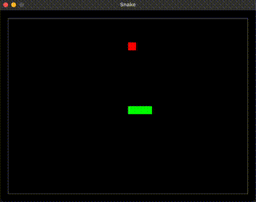

# Toy Projects for Learning C

So far I have just built a basic verison of snake.

## Snake

To build you'll need `gcc` and `sdl2` installed.

```bash
# install sdl2
brew install sdl2
# builds an executable call `snake`
bin/build-snake.sh
# Running build command
# gcc snake.c -Wall -Werror -o snake -I/usr/local/include/SDL2 -L/opt/homebrew/lib -lSDL2
```

To run the game:
```bash
# run the game
./snake
```

Control the snake with the arrow keys.


